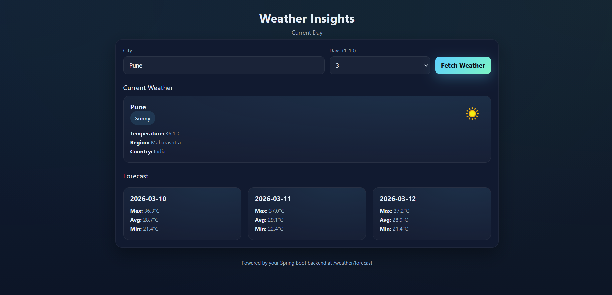
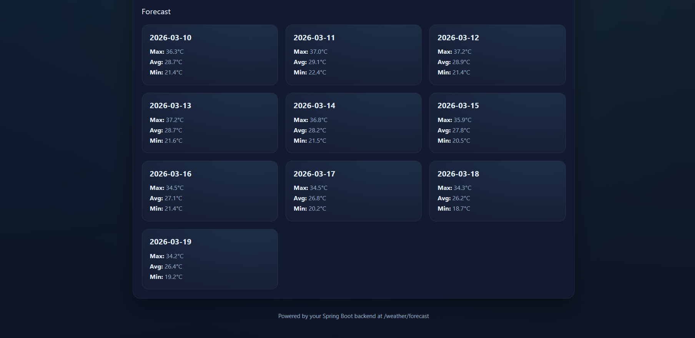

# Weather App (Spring Boot)

A simple Spring Boot service that fetches current weather and forecast data from WeatherAPI and serves a minimal single-page UI.

## Features
- Current conditions + icon for a city
- Forecast list (today + upcoming days)
- Single endpoint: `/weather/forecast/{city}?days=n`
- Static UI at `/` (served from `src/main/resources/static/index.html`)

## Requirements
- Java 21+
- Maven 3.9+
- A WeatherAPI key (free tier works)

## Configuration
Set your WeatherAPI key and base URLs in `src/main/resources/application.properties`:
```properties
weather.api.key=YOUR_KEY_HERE
weather.api.url=http://api.weatherapi.com/v1/current.json
weather.api.forcast.url=http://api.weatherapi.com/v1/forecast.json
```
Note: property name `forcast` matches the existing code; keep it consistent.

## Run locally
```bash
mvn clean spring-boot:run
```
Then open the UI at:
```
http://localhost:8080/
```
Or call the API directly:
```
GET http://localhost:8080/weather/forecast/Pune?days=3
```

## Sample response
```json
{
  "weatherResponse": {
    "city": "Pune",
    "condition": "Sunny",
    "temperature": 35.8,
    "region": "Maharashtra",
    "country": "India",
    "icon": "https://cdn.weatherapi.com/weather/64x64/day/113.png"
  },
  "dayTemp": [
    { "date": "2026-03-10", "minTemp": 21.4, "avgTemp": 28.7, "maxTemp": 36.3 },
    { "date": "2026-03-11", "minTemp": 22.4, "avgTemp": 29.1, "maxTemp": 37.0 },
    { "date": "2026-03-12", "minTemp": 21.4, "avgTemp": 28.9, "maxTemp": 37.2 }
  ]
}
```

## Project layout
- `src/main/java/com/example/weather_app/` — Spring Boot app
  - `controller/Controller.java` — API endpoint
  - `service/WeatherService.java` — calls WeatherAPI, builds responses
  - `dto/` — response/request models
- `src/main/resources/static/index.html` — frontend UI (auto-calls the backend)
- `src/main/resources/application.properties` — configuration

## Frontend usage
- Open `http://localhost:8080/`
- Enter city, choose days (1–10), click **Fetch Weather**
- Shows current conditions with icon and forecast cards

## Notes
- Icon URLs are normalized to `https://` in `WeatherService` so browsers display them correctly.
- Errors from the provider surface as 502/504 via `ResponseStatusException`.
- To change default city/days, edit the defaults in `static/index.html`.



